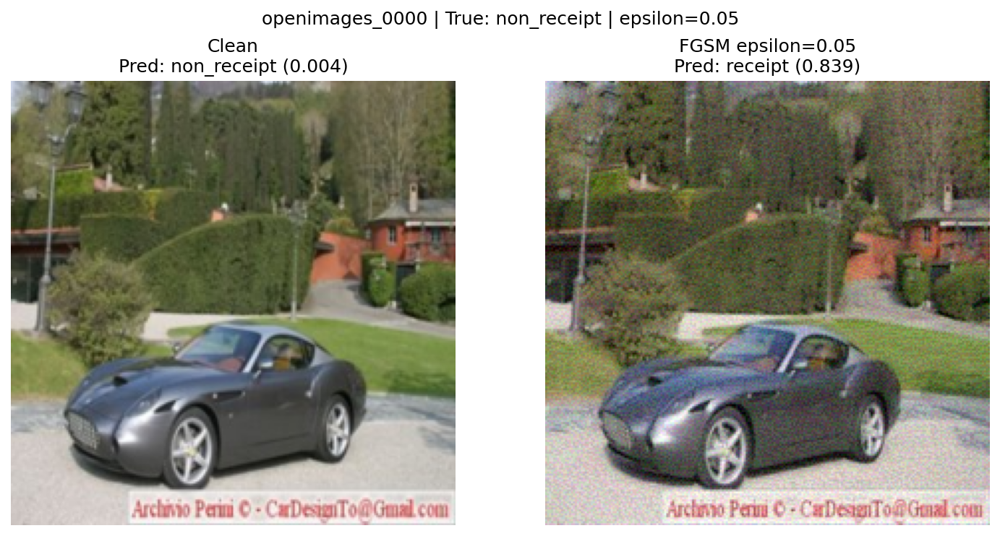
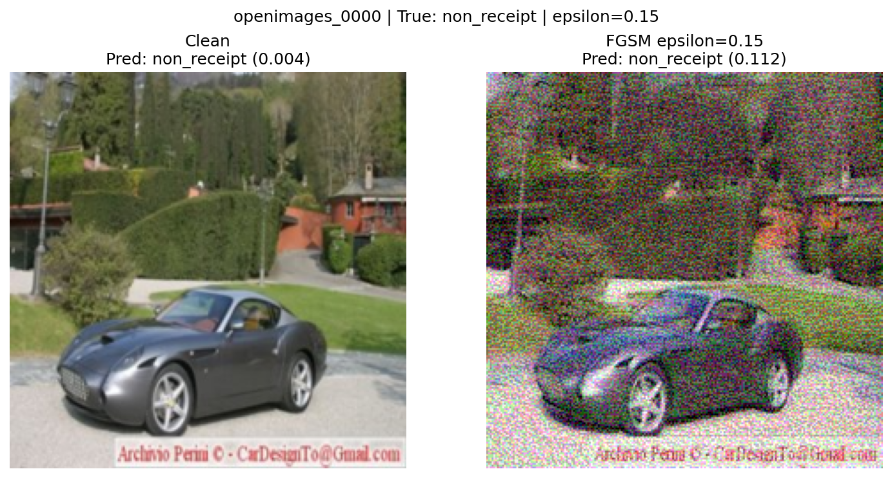

# FGSM Evasion Attack Results

## Clean Model Baseline

Baseline metrics from `evaluate.py` on the shipped clean checkpoint (`receipt_cnn_clean.pt`) against the clean test set (195 receipts / 195 non-receipts):

- **Model:** ReceiptCNN (3-conv CNN, ~26K params, sigmoid output, input 224x224 RGB in [0,1])
- **Test accuracy:** 0.9436
- **Precision:** 0.9943 | **Recall:** 0.8923 | **F1:** 0.9405
- **FGSM baseline:** At **eps = 0.000** the FGSM run reports adversarial accuracy **0.9436**, identical to the clean accuracy above. Because `fgsm_attack()` adds `0 x sign(grad)` and clamps, the "adversarial" image equals the clean image - confirming that all degradation at higher eps comes from the perturbation itself, not from the evaluation loop.

## FGSM Results

Sweep produced by `python 01_fgsm_evasion.py` (results in `../attacks/results/01_fgsm/fgsm_results.json`). Clean accuracy is constant because the model and test set are unchanged; only the input perturbation grows.

| Epsilon | Clean Accuracy | Adversarial Accuracy | Attack Success Rate |
|---------|---------------|---------------------|-------------------|
| 0.000 | 0.9436 | 0.9436 | 0.0000 |
| 0.010 | 0.9436 | 0.8077 | 0.1440 |
| 0.030 | 0.9436 | 0.5103 | 0.4592 |
| 0.050 | 0.9436 | 0.3000 | 0.6821 |
| 0.100 | 0.9436 | 0.2718 | 0.7120 |
| 0.150 | 0.9436 | 0.4462 | 0.5272 |

Adversarial accuracy falls sharply and monotonically from eps=0.00 through eps=0.10 (0.9436 -> 0.2718), a **67-point** collapse, while attack success rate climbs to **0.712** (71% of originally-correct images are pushed to the wrong class).

## Visual Evidence

`visualize_fgsm()` saves one clean-vs-adversarial PNG per eps for the same fixed test sample (`non_receipt/openimages_0000.jpg`), so the comparison is meaningful across eps.

*eps=0.000 - identical to the clean image; prediction unchanged (sanity check).*

*eps=0.010 - perturbation is imperceptible; yet adversarial accuracy already falls to 80.8%.*

*eps=0.030 - noise is still very hard to see, but the model is already at ~51%.*

*eps=0.050 - faint speckling becomes noticeable on close inspection; accuracy drops to 30%.*

*eps=0.100 - noise is clearly visible; accuracy bottoms out at 27.2% (worst case).*

*eps=0.150 - heavy, obvious corruption; accuracy partially recovers to 44.6% (see analysis).*

## Analysis

**1. At what epsilon does accuracy drop below 50%?** Adversarial accuracy is ~51% at eps=0.03 and drops clearly below 50% by **eps=0.05 (30.0%)**. The model is effectively broken in the eps=0.03-0.10 band.

**2. How do you interpret the attack success rate?** ASR is the fraction of *originally-correct* predictions that the attack flips. It rises from 14.4% (eps=0.01) to a peak of **71.2% at eps=0.10** - the attacker reliably overturns most correct decisions with a single gradient step.

**3. Would these perturbations be visible to a human?** The dangerous zone is **eps = 0.01-0.03**: the perturbation is essentially imperceptible (see the PNGs) yet the model already degrades from 94% to ~51%. Noise only becomes obvious at eps>=0.05-0.10. An attacker therefore has a wide margin to fool the classifier without a human reviewer noticing.

**4. Non-monotonic tail at eps=0.15.** Adversarial accuracy rises from 27.2% (eps=0.10) to 44.6% (eps=0.15). This is a known property of single-step FGSM: at large eps the linear approximation overshoots and pixel values saturate against the [0,1] clamp, producing out-of-distribution images that the model sometimes classifies correctly by chance. An iterative attack (e.g. PGD) would keep degrading accuracy instead of recovering. Either way, small, near-invisible perturbations already defeat the model.

**5. Implications for the expense system.** An attacker who can submit images can craft a valid receipt that the classifier scores as *non-receipt* (blocking legitimate reimbursement) or a non-receipt (e.g. a blank or fraudulent image) that scores as *receipt* (enabling fraudulent auto-approval) - all with perturbations too subtle for a human to flag. Automated expense processing must not rely on this classifier alone; see the vulnerability log for recommended defenses (adversarial training, input preprocessing, human-in-the-loop for high-value claims).
