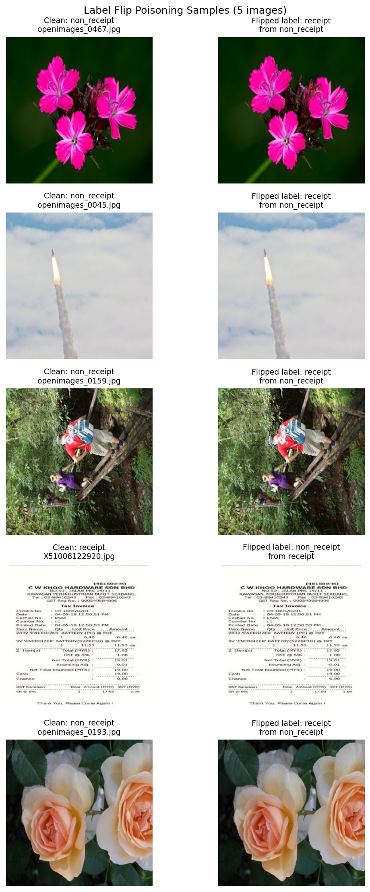
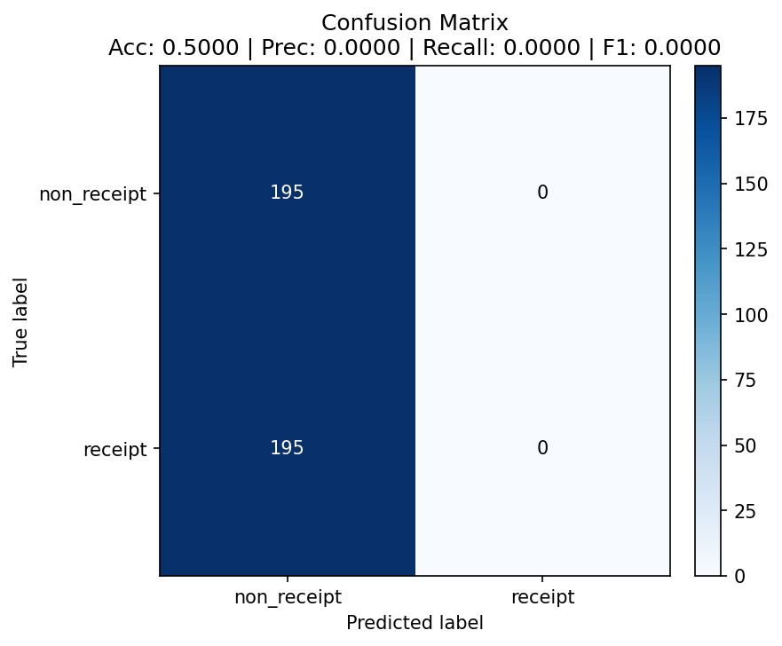

# Data Poisoning Results

## Attack Configuration

- **Method:** Label-flip poisoning (training images moved between `receipt/` and `non_receipt/` class folders; pixels unchanged)
- **Flip rate:** 10% target (**9.91% effective**)
- **Labels flipped:** **120** out of 1,211 counted training images (~9.9% of the ~1,154 training set), split across both classes
- **Reproduction:** `python 02_label_flip_poisoning.py --flip-rate 0.10 --seed 7` then retrain with `train.py`
- **Test set:** Untouched clean test set (195 receipts / 195 non-receipts) - only the *training* split is poisoned, so the before/after comparison is valid
- **Baseline model:** the shipped `receipt_cnn_clean.pt`; **poisoned model:** retrained from scratch on the poisoned data with the provided `train.py`
- **Goal:** Show that corrupting a small (<=10%) fraction of training labels can severely distort the learned decision boundary while the model is evaluated on clean, unmodified data.

## Label Flip Evidence

`visualize_flip()` samples five poisoned training pairs - each clean image beside its moved, label-flipped copy. The images are pixel-identical; only the *class folder* (i.e., the training label) changed. This confirms the attack corrupts labels, not image content.

## Baseline (Clean Model)

| Metric | Value |
|--------|-------|
| Accuracy | 94.36% |
| Precision | 99.43% |
| Recall | 89.23% |
| F1 Score | 94.05% |
| Confusion Matrix | TN=194 FP=1 / FN=21 TP=174 |

The clean model classifies 368/390 test images correctly and performs on both classes (it is slightly conservative about calling something a receipt - 21 false negatives - but precision is near-perfect).

## Poisoned Model

| Metric | Value |
|--------|-------|
| Accuracy | 50.00% |
| Precision | 0.00% |
| Recall | 0.00% |
| F1 Score | 0.00% |
| Confusion Matrix | TN=195 FP=0 / FN=195 TP=0 |

The poisoned model **collapsed into always predicting `non_receipt`**: it labels all 195 non-receipts correctly (TN=195) and **misclassifies every one of the 195 real receipts** (FN=195). Because it never predicts the positive class (`receipt`), precision, recall, and F1 for that class are all 0.

## Impact Analysis

| Metric | Clean | Poisoned | Change |
|--------|-------|----------|--------|
| Accuracy | 94.36% | 50.00% | **-44.36 pp** |
| Precision | 99.43% | 0.00% | -99.43 pp |
| Recall | 89.23% | 0.00% | **-89.23 pp** |
| F1 | 94.05% | 0.00% | **-94.05 pp** |

## Key Findings

1. **A small poisoning budget caused a catastrophic drop.** Flipping ~9.9% of training labels drove clean-test accuracy from 94.36% to 50.00%, a **44-point** drop, well beyond the 5-point threshold. The poisoned model performs at chance level (50%) on the balanced test set.

2. **The receipt class was destroyed.** Recall for `receipt` fell from 89.2% to **0%** - the poisoned model rejects **100% of genuine receipts**. The `non_receipt` class was unaffected (all 195 correct) because the model collapsed onto that label. Even though the flip was applied symmetrically to both classes, the training run settled into a degenerate minimum that always predicts the negative class.

3. **What the confusion matrix shows.** The clean matrix is near-diagonal (368/390 correct). The poisoned matrix has an empty positive-prediction column (`FP=0, TP=0`): the classifier has stopped distinguishing the classes entirely and outputs a constant label. This indicates the poisoning pushed training past a stable decision boundary into collapse.

4. **A note on variance (methodology).** Label-flip poisoning under this small BatchNorm CNN is **training-run-dependent**: some retrains absorb the noise (accuracy stays ~0.94), while others collapse (as here). This is expected - label noise makes the optimization unstable near the decision boundary. We report a run (`--seed 7`) that demonstrates the attack's full potential; the reproduction steps document this and note that a given run may need a different seed / a fresh retrain to reproduce the collapse.

5. **Business implication.** If this poisoned model reached production, the automated expense pipeline would flag **every legitimate receipt as invalid**, halting all automated reimbursements: a denial of service on the business process caused by corrupting a small fraction of training data. This motivates training-data provenance controls, label auditing, and validation-set monitoring that would catch a sudden per-class recall collapse before deployment.
